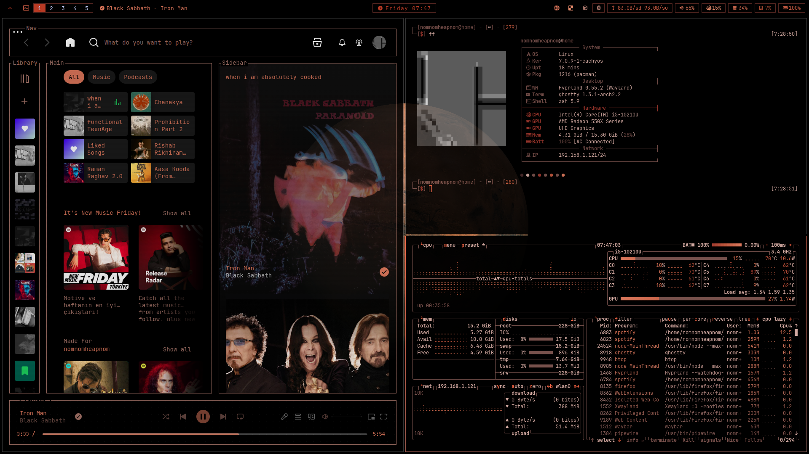

# nomnomheapnom's Dotfiles

This is my personal Hyprland "rice" for Arch Linux, featuring a highly organized collection of configurations for a modern, TUI-driven workflow. It includes specialized 3rd-party tools like Impala for WiFi, Bluetui for Bluetooth, and a custom Wofi-based launcher, all tied together with a dark aesthetic and JetBrains Mono Nerd Fonts. The included `install.sh` script automates the entire setup process by installing necessary packages via `paru` and restoring the configuration structure to your home directory.

