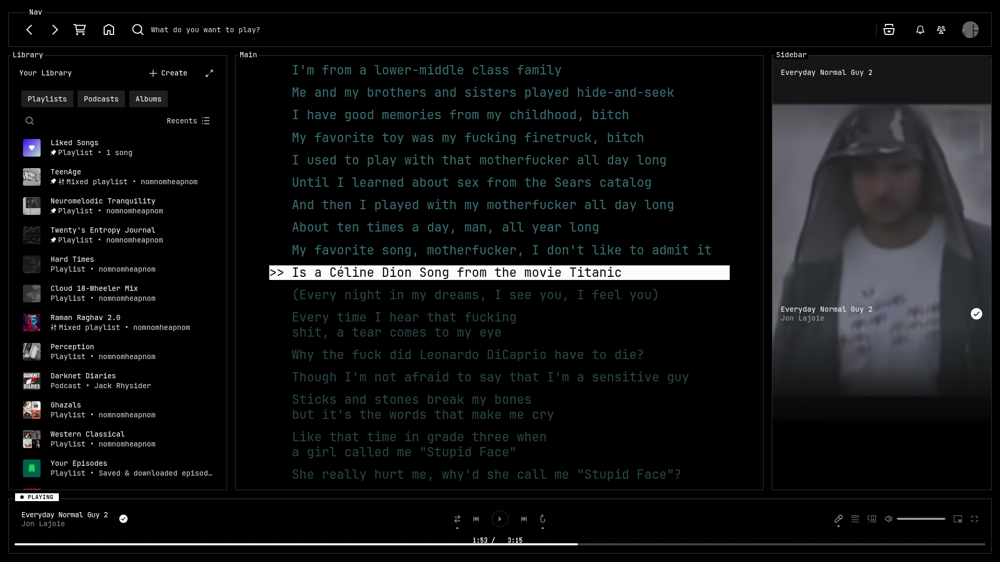

# NNHN Spotify Theme

A retro-inspired Spicetify theme, carefully crafted and based on [Spicetify-retro](https://github.com/Seglats/Spicetify-retro).

## Preview

<picture>
  
</picture>

## Description

This is a Spicetify theme featuring a classic retro aesthetic, customized specifically for NNHN. 
Initial inspiration was drawn from [poolsuite](https://poolsuite.net/).

## Credits

- Base theme framework derived from [spicetify-text](https://github.com/spicetify/spicetify-themes/tree/master/text) by [darkthemer](https://github.com/darkthemer/).
- Rotating vinyl animation adapted from [Turntable](https://github.com/spicetify/spicetify-themes/tree/master/Turntable).
- Retro core implementation by [Seglats](https://github.com/Seglats/Spicetify-retro).

## Installation

### Automated Deployment (Recommended)

A strictly-typed, POSIX-compliant provisioning script (`install.sh`) is provided for automated deployment on Linux environments (specifically tailored for Arch-based distributions).

```bash
chmod +x install.sh
./install.sh
```

**Automated Routine Operations:**
1. Validates the core `spotify` runtime environment and rectifies `/opt/spotify` access parameters via privilege escalation (`sudo`).
2. Resolves `spicetify-cli` package dependencies dynamically, leveraging available AUR helpers (`yay` or `paru`).
3. Instantiates local environment backups (`spicetify backup apply`) to guarantee state reversion capability.
4. Migrates theme assets to `$XDG_CONFIG_HOME` and explicitly executes the configuration apply sequence.

### Manual Deployment

1. Provision the system with the required [Arial-pixel](https://www.dafont.com/pixel-arial-14.font) typographic asset.
2. Clone this repository, transplant the root directory into your recognized Spicetify Themes path (e.g., `~/.config/spicetify/Themes/`), and rename the target node to `NNHN`.
3. Execute the following shell sequence to initialize the theme state:

```bash
spicetify config current_theme NNHN
spicetify config color_scheme Retro
spicetify config inject_theme_js 1
spicetify apply
```

## Configuration & Notes

- **Color Palette Modifications:** The accent variables are categorically defined within `color.ini`. Modify these hexadecimal values to align with preferred terminal design language paradigms (e.g., Catppuccin, Dracula, Gruvbox, Nord).
- **CSS Variable Overrides:** System parameters (typography specifications, UI component overrides) are securely exposed at the head block of `user.css`.
  - Alternatively, to dynamically patch parameters, navigate to `Marketplace > Snippets > + Add CSS` and bind your custom properties (ensure `!important` flags are declared for explicit CSS priority enforcement).
